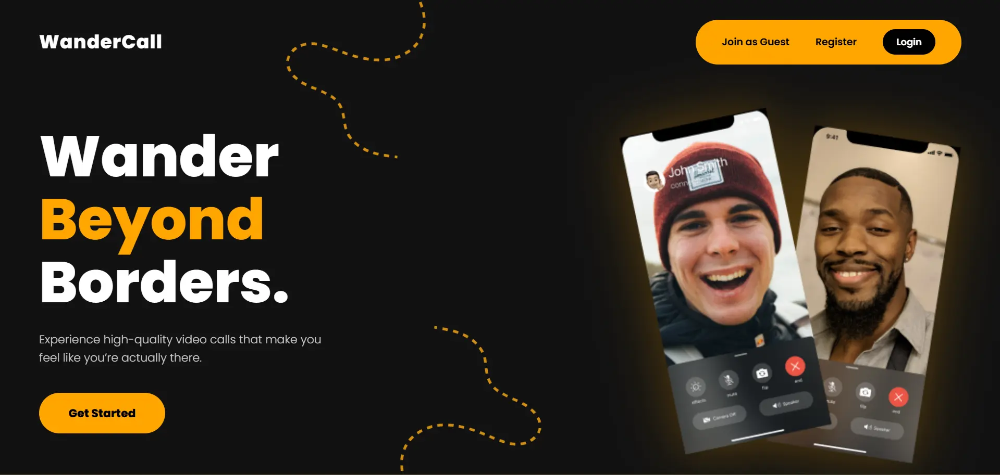
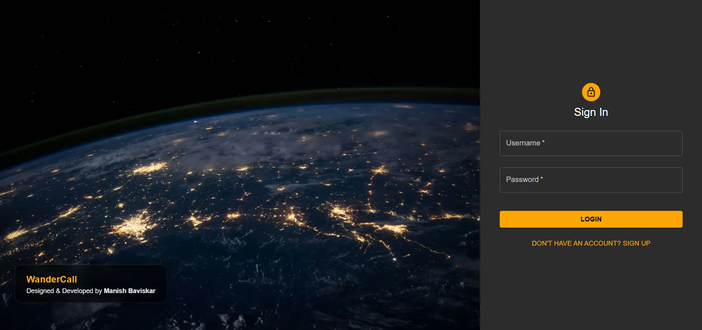
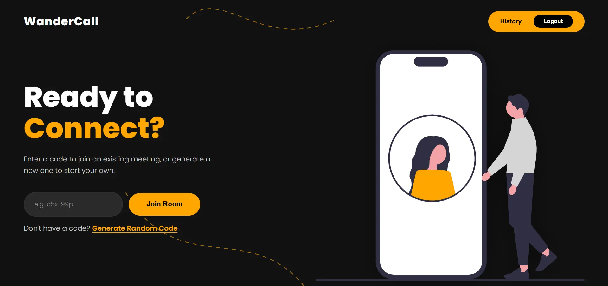
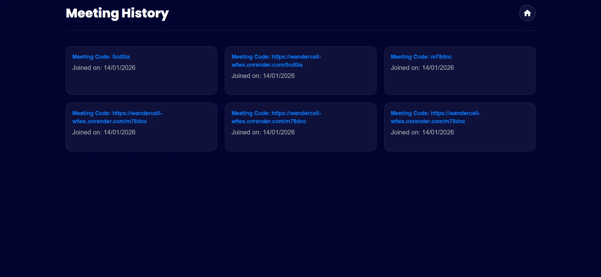
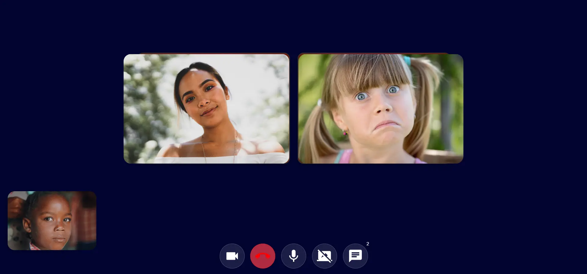
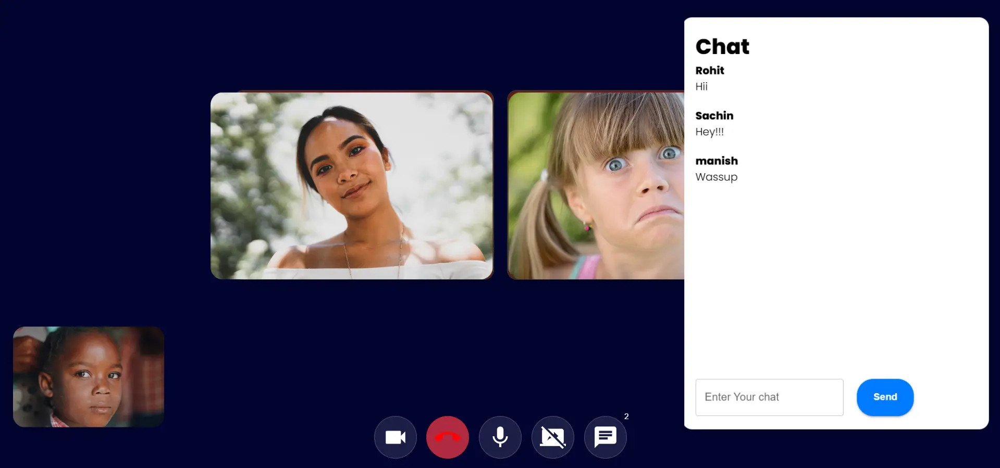

# WanderCall - Video Meet

A robust full-stack video conferencing application built with the MERN stack. WanderCall facilitates low-latency, real-time video and audio communication using WebRTC peer-to-peer architecture, supported by a secure Node.js backend.

### 🔴 **[Live Demo](https://wandercall-wfwx.onrender.com/)** *(Click the link to test the application)*
> 💡 Tip: You can join meetings instantly as a guest or sign in using Google for access to meeting history.


## 🚀 Key Features

-   **Real-time Video & Audio:** High-quality, low-latency streaming using WebRTC.
-   **Instant Messaging:** Integrated chat functionality for participants during calls.
-   **Guest Access:** Allows users to join meetings instantly without mandatory registration.
-   **Secure Authentication:** Google OAuth 2.0 login/signup and email-password authentication using JWT & Bcrypt.
-   **Meeting History:** Persistent tracking of user activity and past meetings.
-   **Room Management:** Dynamic room creation and joining logic.
-   **Responsive Design:** Works on desktop and mobile browsers.

## 📸 Application Previews

<table>
  <tr>
    <td align="center"><b>Landing Page</b></td>
    <td align="center"><b>Login & Signup</b></td>
    <td align="center"><b>Home Dashboard</b></td>
  </tr>
  <tr>
    <td></td>
    <td></td>
    <td></td>
  </tr>
  <tr>
    <td align="center"><b>Meeting History</b></td>
    <td align="center"><b>Video Meeting</b></td>
    <td align="center"><b>In-Call Chat</b></td>
  </tr>
  <tr>
    <td></td>
    <td></td>
    <td></td>
  </tr>
</table>

## 🏗️ Architecture & Protocols

WanderCall relies on a hybrid architecture combining **Client-Server** signaling and **Peer-to-Peer (P2P)** media streaming.

### 1. Signaling (WebSocket)
Before a direct video connection can be established, peers must find each other. We use **Socket.io** as the signaling mechanism to exchange:
* **Session Description Protocol (SDP):** For negotiating media capabilities (codecs, resolution).
* **ICE Candidates:** For network path discovery (NAT traversal).

### 2. Peer-to-Peer Media (WebRTC)
Once signaling is complete, the application uses **WebRTC** to establish a direct P2P connection between clients.
* **Architecture:** Mesh Topology (Direct connection between participants).
* **Transport:** UDP (preferred for speed) with TCP fallback.
* **Security:** All media streams are encrypted using **SRTP** (Secure Real-time Transport Protocol) and **DTLS** (Datagram Transport Layer Security).

### 3. Cryptography
* **Token Generation:** Uses Node.js native `crypto` module to generate secure, random hex tokens for session management.
* **Password Hashing:** Uses `bcrypt` for secure salt-and-hash storage of user credentials.

## 🔐 Authentication & Authorization

WanderCall supports both **OAuth-based** and **credential-based** authentication mechanisms to ensure flexibility and security.

### Google OAuth 2.0
- Enables users to **sign up and sign in using their Google account**
- Eliminates the need to remember passwords
- OAuth flow is handled securely via Passport.js
- Google access tokens are verified on the backend before session creation

### Email & Password Authentication
- Passwords are securely hashed using **bcrypt**
- Authentication is handled using **JWT (JSON Web Tokens)**
- Tokens are used to protect user-specific routes and meeting history

This hybrid approach ensures both **ease of access** and **strong security**.

## 🛠️ Tech Stack

### Frontend
-   **React.js:** Component-based UI architecture.
-   **Context API:** For global state management (Auth, Socket).
-   **Material UI:** Responsive and accessible design components.

### Backend
-   **Node.js & Express.js:** RESTful API and Signaling server.
-   **Socket.io:** Real-time bi-directional event-based communication.
-   **MongoDB & Mongoose:** NoSQL database for flexible data modeling.
-   **Passport.js:** Authentication middleware for Google OAuth 2.0.
-   **bcrypt:** Secure password hashing
-   **Crypto:** Secure random byte generation for tokens.
-   **JWT:** Stateless authentication.

## 📂 Project Structure

```text
root
├── frontend/          # React Client (Vite/CRA)
├── backend/           # Node.js Server & API
└── README.md          # Documentation
```

## ⚙️ Installation & Run Locally

### Prerequisites
-   Node.js installed
-   MongoDB installed locally or a MongoDB Atlas connection string

### 1. Clone the Repository
```bash
git clone https://github.com/Manish-Baviskar/WanderCall-Video-Meet.git
cd WanderCall-Video-Meet
```

### 2. Backend Setup
Navigate to the backend folder and install dependencies.

```bash
cd backend
npm install
```

**Configure Environment Variables:**
Create a `.env` file in the `backend/` folder and add your specific credentials:

```properties
PORT=8000
MONGO_URL=mongodb+srv://<username>:<password>@cluster0.mongodb.net/wandercall
GOOGLE_CLIENT_ID=your_google_client_id
GOOGLE_CLIENT_SECRET=your_google_client_secret
GOOGLE_CALLBACK_URL=http://localhost:8080/auth/google/callback
```

**Start the Server:**
```bash
npm start
# Server runs on http://localhost:8080
```

### 3. Frontend Setup
Open a new terminal, navigate to the frontend folder, and install dependencies.

```bash
cd frontend
npm install
```

**Start the React App:**
```bash
npm start
# Client runs on http://localhost:3000
```

## 🔐 Environment Variables Reference

**Backend (`backend/.env`):**
| Variable | Description |
| :--- | :--- |
| `PORT` | Port number for the server (default: 8080) |
| `MONGO_URL` | MongoDB connection string (Required) |

## 🚀 Deployment

The application is optimized for deployment on cloud platforms:
-   **Frontend:** Vercel / Netlify
-   **Backend:** Render / Heroku / Railway

*Note: Ensure you add the Environment Variables in your hosting dashboard settings.*

## 🤝 Contributing

Contributions are welcome!
1.  Fork the Project
2.  Create your Feature Branch (`git checkout -b feature/NewFeature`)
3.  Commit your Changes (`git commit -m 'Add NewFeature'`)
4.  Push to the Branch (`git push origin feature/NewFeature`)
5.  Open a Pull Request

## 📄 License

Distributed under the MIT License. See `LICENSE` for more information.

## 📞 Contact

Your Name - [MANISH BAVISKAR](https://www.linkedin.com/in/manishbaviskar)
Project Link: [https://github.com/Manish-Baviskar/WanderCall-Video-Meet](https://github.com/Manish_Baviskar/WanderCall-Video-Meet)

